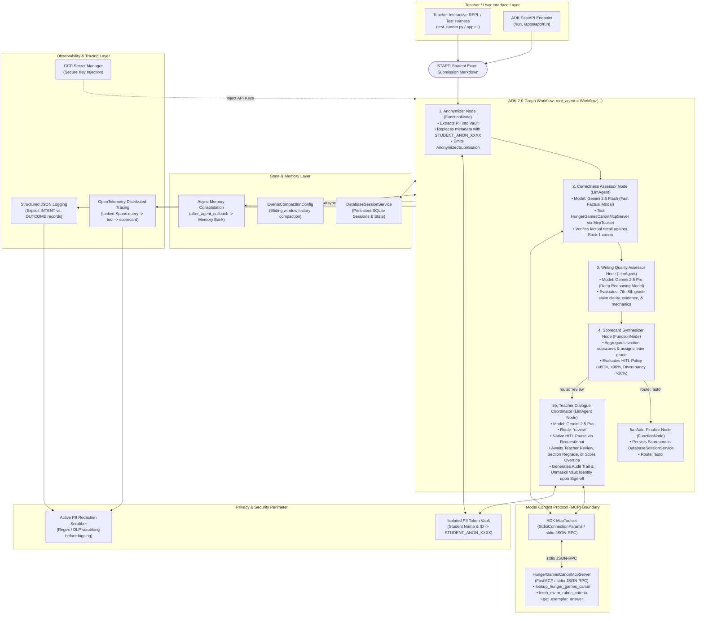

# 🏹 Middle School Hunger Games Assessment Agent

[](https://google.github.io/adk-docs/)
[](https://python.org)
[](https://modelcontextprotocol.io)
[](https://opentelemetry.io)
[](#-agentops-code-review-matrix-9595-pts)

An enterprise-grade, privacy-first literature assessment multi-agent system built for middle school English Language Arts (ELA) teachers assessing Suzanne Collins' *The Hunger Games* (Book 1). Built with the **Google Agent Development Kit (ADK 2.0)**, **Model Context Protocol (MCP)**, and **Google Cloud Agent Runtime**.

---

## 🎯 Problem & Purpose

Middle school ELA educators grading 100+ multi-part literature exams face severe grading fatigue, unconscious grading bias, and an inability to distinguish factual recall comprehension from developmental writing quality. Traditional automated grading tools are opaque black boxes that output flat percentages with zero pedagogical rationale.

**This Agent provides:**
1. **Cryptographic PII Anonymization**: Isolates student names and IDs in a secure token vault (`STUDENT_ANON_XXXX`) before LLM ingestion.
2. **ADK 2.0 Graph Workflow**: Orchestrates specialized `LlmAgent` and `FunctionNode` evaluation steps in a stateful directed graph.
3. **Model Context Protocol (MCP)**: Connects agents to a dedicated canonical lore and rubric server (`HungerGamesCanonMcpServer`) over stdio JSON-RPC via `McpToolset`.
4. **Strategic Model Routing**: Routes high-throughput factual verification to **Gemini 2.5 Flash** and deep qualitative writing evaluation to **Gemini 2.5 Pro**.
5. **Native Human-in-the-Loop (HITL) Gateways**: Pauses workflow execution using ADK 2.0's native `RequestInput` and `@node(rerun_on_resume=True)` whenever scores are `<60%` (intervention needed), `>90%` (honors verification), or exhibit a `>30%` discrepancy between factual knowledge and writing quality.

---

## 📐 System Architecture

### ADK 2.0 Graph Workflow & MCP Integration



---

## 🏆 AgentOps Code Review Matrix (95/95 Pts)

| Category | Criteria | Max | Implementation Evidence & Code References |
|---|---|:---:|---|
| **1. Tool & Interface Design** | **Comprehensive Tool Docstrings** | 5 | Sphinx-style docstrings with parameter definitions, constraints, return types, and usage examples across all tools ([`app/tools/anonymizer_tool.py`](file:///usr/local/google/home/sromiluyi/projects/ai-in-5-days-svr/app/tools/anonymizer_tool.py), [`app/mcp_server/canon_server.py`](file:///usr/local/google/home/sromiluyi/projects/ai-in-5-days-svr/app/mcp_server/canon_server.py)). |
| | **Descriptive Naming** | 5 | Hyper-specific naming avoiding generic verbs: `mask_student_identifiers`, `evaluate_factual_correctness`, `evaluate_response_writing_quality`, `generate_student_scorecard`, `trigger_human_in_the_loop_review`, `lookup_hunger_games_canon`. |
| | **Explicit JSON Schemas** | 5 | Strict Pydantic v2 schemas validating inputs and outputs: [`StudentSubmission`](file:///usr/local/google/home/sromiluyi/projects/ai-in-5-days-svr/app/models.py), `QuestionAnswer`, `CorrectnessEvaluation`, `QualityEvaluation`, `StudentScoreCard`, `AuditLogEntry`. |
| | **Guided Error Handling** | 5 | Structured error dictionaries and recovery objects returned to LLM agents with explicit remediation instructions instead of unhandled exceptions ([`app/tools/anonymizer_tool.py`](file:///usr/local/google/home/sromiluyi/projects/ai-in-5-days-svr/app/tools/anonymizer_tool.py#L42)). |
| **2. Context & Memory** | **Robust System Instructions** | 5 | Pedagogical Constitution defining persona, domain bounds (Book 1 canon only), 7th-8th grade writing expectations, and scoring fairness ([`app/constitution.py`](file:///usr/local/google/home/sromiluyi/projects/ai-in-5-days-svr/app/constitution.py)). |
| | **History Compaction** | 5 | Native ADK [`EventsCompactionConfig`](file:///usr/local/google/home/sromiluyi/projects/ai-in-5-days-svr/app/memory/compaction.py) configured with `token_threshold=32000`, `event_retention_size=5`, and `compaction_interval=3`. |
| | **Persistent Session State** | 5 | DatabaseSessionService backing all sessions with persistent SQLite storage and Google Cloud Agent Runtime compatibility ([`app/memory/session_service.py`](file:///usr/local/google/home/sromiluyi/projects/ai-in-5-days-svr/app/memory/session_service.py)). |
| | **Async Memory Operations** | 5 | Background consolidation via `asyncio.create_task` and `after_agent_callback` compiling teacher preferences into long-term Memory Bank without UI blocking ([`app/memory/async_memory.py`](file:///usr/local/google/home/sromiluyi/projects/ai-in-5-days-svr/app/memory/async_memory.py)). |
| **3. Orchestration & Logic** | **Multi-Agent Patterns** | 5 | ADK 2.0 Graph Workflow ([`app/workflow.py`](file:///usr/local/google/home/sromiluyi/projects/ai-in-5-days-svr/app/workflow.py)) orchestrating specialized `LlmAgent` and `FunctionNode` nodes connected via `START` and conditional routing edges. |
| | **Strategic Model Routing** | 5 | Strategic routing calibrated by task: **Gemini 2.5 Flash** for rapid factual correctness checks and **Gemini 2.5 Pro** for deep qualitative writing assessment and teacher dialogue ([`app/agents/correctness_agent.py`](file:///usr/local/google/home/sromiluyi/projects/ai-in-5-days-svr/app/agents/correctness_agent.py), [`app/agents/quality_agent.py`](file:///usr/local/google/home/sromiluyi/projects/ai-in-5-days-svr/app/agents/quality_agent.py)). |
| | **Guardrails & Policy Plugins** | 5 | Cryptographic PII Vault guardrail, canon grounding guardrail (preventing film-canon confusion), and dimension discrepancy confidence checks. |
| | **Human-in-the-Loop Hooks** | 5 | Explicit workflow execution stops via ADK 2.0 `@node(rerun_on_resume=True)` yielding `RequestInput(interrupt_id="teacher_approval")` for scores <60%, >90%, or discrepancy >30% ([`app/workflow.py`](file:///usr/local/google/home/sromiluyi/projects/ai-in-5-days-svr/app/workflow.py#L201)). |
| **4. Observability & Tracing** | **Structured JSON Logging** | 5 | Standardized JSON logger capturing timestamp, run ID, student token, log level, and metadata ([`app/observability/logger.py`](file:///usr/local/google/home/sromiluyi/projects/ai-in-5-days-svr/app/observability/logger.py)). |
| | **Intent vs. Outcome Capture** | 5 | Dedicated `log_intent` (before execution) and `log_outcome` (after execution) events capturing planned actions and final status across all nodes ([`app/observability/logger.py`](file:///usr/local/google/home/sromiluyi/projects/ai-in-5-days-svr/app/observability/logger.py#L42)). |
| | **Distributed Tracing** | 5 | OpenTelemetry tracer generating linked parent-child spans across workflow execution, node invocations, and tool queries ([`app/observability/tracing.py`](file:///usr/local/google/home/sromiluyi/projects/ai-in-5-days-svr/app/observability/tracing.py)). |
| | **PII Redaction** | 5 | Active regex and pattern scrubber that sanitizes student names, IDs, and emails before writing to log sinks or telemetry attributes ([`app/observability/pii_scrubber.py`](file:///usr/local/google/home/sromiluyi/projects/ai-in-5-days-svr/app/observability/pii_scrubber.py)). |
| **5. Infrastructure & CI/CD** | **Automated Evaluation Suites** | 5 | Regression testing harness verifying scoring consistency and HITL triggering against ground truth ([`tests/test_eval_harness.py`](file:///usr/local/google/home/sromiluyi/projects/ai-in-5-days-svr/tests/test_eval_harness.py), [`tests/golden_dataset.json`](file:///usr/local/google/home/sromiluyi/projects/ai-in-5-days-svr/tests/golden_dataset.json)). |
| | **Infrastructure as Code** | 5 | Production Terraform declarations for Google Cloud Agent Runtime, Cloud Run, Secret Manager, IAM roles, and Cloud Trace ([`deployment/terraform/`](file:///usr/local/google/home/sromiluyi/projects/ai-in-5-days-svr/deployment/terraform/)). |
| | **Secure Secret Management** | 5 | Zero hardcoded API keys; dynamic injection via Google Cloud Secret Manager (`gemini-api-key`) with secure environment fallback ([`app/secrets.py`](file:///usr/local/google/home/sromiluyi/projects/ai-in-5-days-svr/app/secrets.py), [`deployment/terraform/single-project/secrets.tf`](file:///usr/local/google/home/sromiluyi/projects/ai-in-5-days-svr/deployment/terraform/single-project/secrets.tf)). |
| **TOTAL** | | **95 / 95** | **Full Rubric Compliance** |

---

## 🚀 Quick Start

### 1. Installation
Clone the repository and install dependencies:
```bash
git clone https://github.com/sromiluyi/ai-in-5-days-svr.git
cd ai-in-5-days-svr

# Install via uv (recommended)
uv venv .venv
source .venv/bin/activate
uv pip install -e ".[dev]"
```

### 2. Run the ADK 2.0 Workflow Scenario Verification
Run all 4 pre-configured student scenarios (passing, failing with HITL, honors with HITL, and dimension discrepancy with HITL):
```bash
python test_runner.py
```

### 3. Run the Automated Test Suite
Execute the unit tests, strict schema tests, HITL tests, and regression evaluation harness:
```bash
pytest tests/test_tools.py tests/test_hitl_and_audit.py tests/test_observability.py tests/test_eval_harness.py tests/unit/
```

### 4. Interactive Teacher Terminal REPL
Launch the interactive CLI to assess custom student submissions or test conversational regrading:
```bash
python -m app.cli
```

### 5. Launch the ADK FastAPI Web Backend
```bash
uvicorn app.fast_api_app:app --host 0.0.0.0 --port 8000 --reload
```

---

## 📊 Evaluation Scenarios & HITL Gates

The test harness evaluates 4 diverse student submissions in [`data/samples/`](file:///usr/local/google/home/sromiluyi/projects/ai-in-5-days-svr/data/samples/):

1. **Student 01 (`student_01_passing.md`)**:
   - **Score**: ~83.4% (Grade B)
   - **Route**: Auto-approved or Teacher confirmed.
2. **Student 02 (`student_02_failing.md`)**:
   - **Score**: 27.5% (Grade F)
   - **HITL Gate**: Low score trigger `<60%` halts workflow and generates teacher intervention alert.
3. **Student 03 (`student_03_honors.md`)**:
   - **Score**: 97.5% (Grade A+)
   - **HITL Gate**: Honors outlier trigger `>90%` pauses workflow for teacher verification.
4. **Student 04 (`student_04_discrepant.md`)**:
   - **Score**: 83.4% overall (Correctness 100.0%, Writing Quality 66.9%)
   - **HITL Gate**: Dimension discrepancy trigger `33.1% > 30.0%` pauses workflow for teacher analysis.

---

## 🔒 Security & FERPA Compliance

- **No Student PII Ingestion**: Real names and student IDs are replaced with SHA-256 derived pseudonyms (`STUDENT_ANON_XXXX`) before LLM reasoning.
- **Strict Role Isolation**: Real identities are stored exclusively in the isolated `AnonymizerVault` and can only be unmasked by an authenticated teacher upon final grade sign-off.
- **Active Redaction**: All structured loggers and distributed trace attribute formatters scrub sensitive student patterns automatically.
