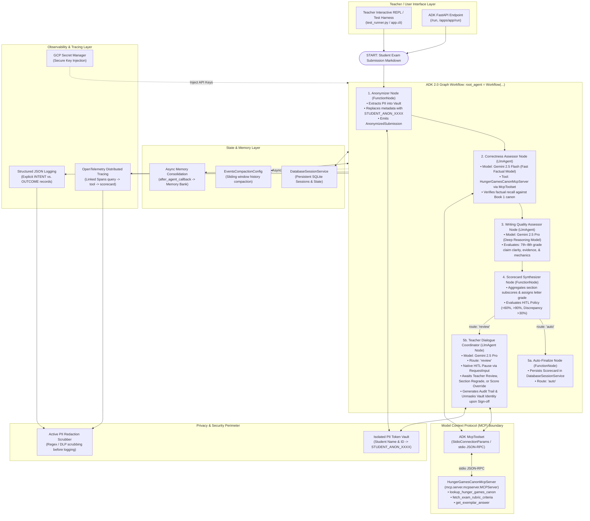

# System Architecture & Technical Design

## 1. System Architecture Overview

The **Middle School Hunger Games Assessment Agent** is engineered as an enterprise-grade, privacy-preserving **ADK 2.0 Graph Workflow** (`google.adk.workflow.Workflow`) where the primary evaluation steps are executed by specialized **`LlmAgent` nodes**, backed by the Model Context Protocol (MCP) for ground-truth canon retrieval and native Human-in-the-Loop hooks.

### High-Level Architecture Flowchart



---

## 2. Sequence Diagram: Lifecycle of an Exam Assessment

```mermaid
sequenceDiagram
    autonumber
    actor Teacher as Teacher / Educator
    participant Workflow as ADK 2.0 Workflow Engine
    participant Vault as PII Vault & Scrubber
    participant Corr as Correctness Agent (LlmAgent Node - Flash)
    participant MCP as HungerGamesCanonMcpServer
    participant Qual as Quality Agent (LlmAgent Node - Pro)
    participant Synth as Scorecard Synthesizer Node
    participant Coord as Teacher Review Node (LlmAgent Node - Pro)
    participant Session as Session & Trace Store

    Teacher->>Workflow: Submit raw exam markdown (Name, ID, Answers)
    Workflow->>Vault: Anonymizer Node: Extract PII; Assign STUDENT_ANON_E7B1
    Vault-->>Workflow: Anonymized Submission (Student answers without PII)
    
    Workflow->>Corr: Run Correctness Assessor Node (Gemini 2.5 Flash)
    Corr->>MCP: Query HungerGamesCanonMcpServer via McpToolset (stdio)
    MCP-->>Corr: Canonical lore facts & rubric criteria
    Corr-->>Workflow: CorrectnessEvaluation (per question scores & facts identified)
    
    Workflow->>Qual: Run Writing Quality Assessor Node (Gemini 2.5 Pro)
    Note over Qual: Assesses 7th-8th grade literacy standards,<br/>textual evidence & mechanics
    Qual-->>Workflow: QualityEvaluation (analytical depth, clarity ratings)
    
    Workflow->>Synth: Synthesize Scorecard & Evaluate HITL Policy
    Synth->>Synth: Calculate overall percentage & letter grade
    
    alt Normal Score (60% - 90%, Discrepancy <= 30%)
        Synth-->>Workflow: Route 'auto'
        Workflow->>Session: Auto-Finalize: Save scorecard to DatabaseSessionService
        Workflow-->>Teacher: Finalized Scorecard Output
    else Flagged Score (<60%, >90%, or Discrepancy >30%)
        Synth-->>Workflow: Route 'review'
        Workflow->>Coord: Invoke Teacher Review Node
        Coord-->>Teacher: Yield RequestInput(interrupt_id="teacher_approval") [WORKFLOW PAUSES]
        
        Teacher->>Workflow: Resume with Teacher Decision / Override ("yes" / "override 85.0")
        Workflow->>Coord: Resume node with ctx.resume_inputs
        Coord->>Coord: Record AuditLogEntry (action, delta, rationale)
        Coord->>Vault: Unmask real student identity for authorized teacher
        Vault-->>Coord: Student Real Identity
        Coord-->>Workflow: Final Approved Scorecard
        Workflow->>Session: Save approved grade record
        Workflow-->>Teacher: Final Scorecard with Audit Trail & Revealed Identity
    end
```

---

## 3. Project Scaffolding & Directory Structure

```
ai-in-5-days-svr/
├── .agents-cli-spec.md               # Formal agents-cli system specification
├── .env.example                      # Template for secure environment configuration
├── .gitignore                        # Git ignore rules (secrets, venvs, cache)
├── Dockerfile                        # Production container image for Agent Runtime
├── README.md                         # Main repository landing page & rubric evidence
├── pyproject.toml                    # Poetry/uv packaging & dependencies
├── agents-cli-manifest.yaml          # agents-cli deployment metadata
├── test_runner.py                    # ADK 2.0 Workflow verification suite & scenario runner
├── app/
│   ├── __init__.py
│   ├── agent.py                      # Root ADK 2.0 Graph Workflow (root_agent = assessment_workflow)
│   ├── workflow.py                   # Graph Workflow topology (START -> Anonymize -> Eval -> HITL)
│   ├── cli.py                        # Interactive CLI REPL for teacher grading
│   ├── fast_api_app.py               # Production ADK FastAPI web service
│   ├── config.py                     # Environment variables, thresholds, models
│   ├── constitution.py               # Robust Pedagogical Constitution (System Instructions)
│   ├── models.py                     # Strict Pydantic schemas (Submissions, Scorecard, Audit)
│   ├── secrets.py                    # GCP Secret Manager key resolution
│   ├── agents/
│   │   ├── __init__.py
│   │   ├── correctness_agent.py      # Gemini 2.5 Flash factual assessor
│   │   ├── quality_agent.py          # Gemini 2.5 Pro writing quality assessor
│   │   ├── coordinator_agent.py      # Teacher dialogue coordinator & regrading
│   │   └── scorecard_agent.py        # Scorecard synthesis & HITL threshold checker
│   ├── mcp_server/
│   │   ├── __init__.py
│   │   └── canon_server.py           # HungerGamesCanonMcpServer (FastMCP stdio JSON-RPC)
│   ├── tools/
│   │   ├── __init__.py
│   │   ├── anonymizer_tool.py        # PII extraction & tokenized vault tool
│   │   ├── evaluation_tools.py       # Correctness & quality evaluation tools
│   │   ├── hitl_tools.py             # Human-in-the-loop review trigger tools
│   │   └── regrade_tools.py          # Targeted agent re-dispatch & override audit tools
│   ├── memory/
│   │   ├── __init__.py
│   │   ├── session_service.py        # Persistent session store (Agent Runtime / SQLite)
│   │   ├── compaction.py             # ADK token compaction & sliding window config
│   │   └── async_memory.py           # Background async memory consolidation worker
│   └── observability/
│       ├── __init__.py
│       ├── logger.py                 # Structured JSON logging (Intent vs. Outcome)
│       ├── tracing.py                # OpenTelemetry distributed tracing setup
│       └── pii_scrubber.py           # Regex & DLP-based sensitive data scrubber
├── data/
│   ├── exam_rubric.md                # Official Middle School Hunger Games Exam Rubric
│   ├── answer_key.md                 # Canonical Hunger Games Answer Key
│   └── samples/
│       ├── student_01_passing.md     # Solid student submission (~82%)
│       ├── student_02_failing.md     # Sub-60% submission (triggers HITL low)
│       ├── student_03_honors.md      # >90% submission (triggers HITL high)
│       └── student_04_discrepant.md  # High correctness, poor writing (triggers HITL gap)
├── tests/
│   ├── __init__.py
│   ├── conftest.py                   # Pytest fixtures and mock configurations
│   ├── golden_dataset.json           # Ground-truth evaluation dataset
│   ├── test_tools.py                 # Strict schema & error handling validation
│   ├── test_hitl_and_audit.py        # Threshold pauses & audit trail tests
│   ├── test_observability.py         # JSON logs, Intent/Outcome, PII scrubbing tests
│   ├── test_eval_harness.py          # Automated regression evaluation harness
│   └── unit/
│       └── test_dummy.py             # Base unit test verification
└── deployment/
    ├── terraform/
    │   ├── main.tf                   # Terraform for Agent Runtime / Cloud Run
    │   ├── variables.tf              # Configurable project, region, service account
    │   ├── outputs.tf                # Service URLs and resource IDs
    │   ├── apis.tf                   # Enabled GCP APIs (Secret Manager, Vertex AI, Tracing)
    │   └── secrets.tf                # Secret Manager declaration for GEMINI_API_KEY
    └── workflows/
        └── ci-cd.yml                 # GitHub Actions pipeline (Lint, Eval, Build, Deploy)
```

---

## 4. Key Architectural Patterns & Rubric Implementation

### 1. Tool & Interface Design (20 pts)
- **Model Context Protocol (MCP)**: Canonical domain lore, rubric criteria, and exemplars are exposed via an enterprise MCP server (`HungerGamesCanonMcpServer`) and consumed by agents using ADK's `McpToolset` over stdio JSON-RPC (`StdioConnectionParams`).
- **Comprehensive Docstrings**: Every tool function has extensive Sphinx-style docstrings with typed parameter definitions, operational constraints, return descriptions, and usage examples.
- **Descriptive Naming**: Granular names such as `mask_student_identifiers`, `evaluate_factual_correctness`, `evaluate_response_writing_quality`, `generate_student_scorecard`, `trigger_human_in_the_loop_review`, `regrade_assessment_section`, `override_section_score_with_audit`, `lookup_hunger_games_canon`.
- **Explicit JSON Schemas**: Strict Pydantic v2 schemas (`StudentSubmission`, `QuestionAnswer`, `CorrectnessEvaluation`, `QualityEvaluation`, `StudentScoreCard`, `AuditLogEntry`) validating all inputs and constraining LLM outputs.
- **Guided Error Handling**: Tools catch errors and return structured `ToolRecoveryResponse` objects containing error descriptions, error codes, and specific remediation instructions for the calling LLM.

### 2. Context & Memory (20 pts)
- **Robust System Constitution**: A comprehensive pedagogical constitution defining persona, domain boundaries (Suzanne Collins' *The Hunger Games* Book 1 only), 7th–8th grade developmental writing expectations, and fairness policies.
- **History Compaction**: Integration of ADK `EventsCompactionConfig` with token-based thresholding (32,000 tokens) and sliding window event retention (`event_retention_size=5`) to prevent context bloat during extended teacher dialogue.
- **Persistent Session State**: Automatic integration with Google Cloud Agent Runtime's `VertexAiSessionService` in production, with local SQLite fallback for testing and development.
- **Async Memory Operations**: Background consolidation via `after_agent_callback` and `asyncio.create_task` that compiles teacher preferences and class performance patterns into Memory Bank without blocking the conversational response.

### 3. Orchestration & Logic (20 pts)
- **Multi-Agent Graph Workflow**: An ADK 2.0 Graph Workflow (`google.adk.workflow.Workflow`) where evaluation steps are specialized `LlmAgent` and `FunctionNode` nodes (`anonymize_submission_node` -> `evaluate_correctness_node` -> `evaluate_quality_node` -> `synthesize_and_route_node` -> `auto_approve_node` / `teacher_review_node`).
- **Strategic Model Routing**:
  - `gemini-2.5-flash`: Fast, high-throughput factual accuracy verification and answer key matching in `correctness_assessor`.
  - `gemini-2.5-pro`: Deep qualitative writing evaluation, nuanced essay reasoning, and conversational coordinator reasoning in `quality_assessor` and `teacher_dialogue_coordinator`.
- **Guardrails & Policy Plugins**: Input PII anonymization guardrail, canonical grounding guardrail (preventing film-canon contamination), and self-evaluation confidence scoring.
- **Human-in-the-Loop Hooks**: Explicit execution stops triggered via ADK 2.0 `@node(rerun_on_resume=True)` yielding `RequestInput(interrupt_id="teacher_approval")` when overall score < 60%, > 90%, or when correctness vs. quality gap > 30%, requiring teacher authorization before final grade persistence.

### 4. Observability & Tracing (20 pts)
- **Structured JSON Logging**: Standardized JSON log output capturing timestamp, run ID, student pseudonym token, agent name, log level, and contextual metadata.
- **Intent vs. Outcome Tracking**: Explicit logging of `INTENT: <planned action>` prior to execution and `OUTCOME: <actual result/delta>` following execution for full agent explainability.
- **Distributed Tracing**: OpenTelemetry instrumentation establishing parent-child span relationships across incoming requests, workflow executions, node invocations, tool executions, and LLM calls.
- **PII Redaction**: Active regex and pattern scrubbing in log sinks and OpenTelemetry attributes ensuring zero raw student names or IDs leak to storage or telemetry backends.

### 5. Infrastructure & CI/CD (15 pts)
- **Automated Evaluation Suite**: Automated test harness running against `golden_dataset.json` with assertions on factual accuracy tolerance, writing quality consistency, and HITL gate activation.
- **Infrastructure as Code**: Production Terraform declarations in `deployment/terraform/` defining Google Cloud Vertex AI Agent Runtime, IAM service accounts, Secret Manager secrets (`gemini-api-key`), and telemetry sinks.
- **Secure Secret Management**: Complete separation of secrets via environment variables (`.env.example`) and Google Secret Manager, with zero hardcoded API keys.
