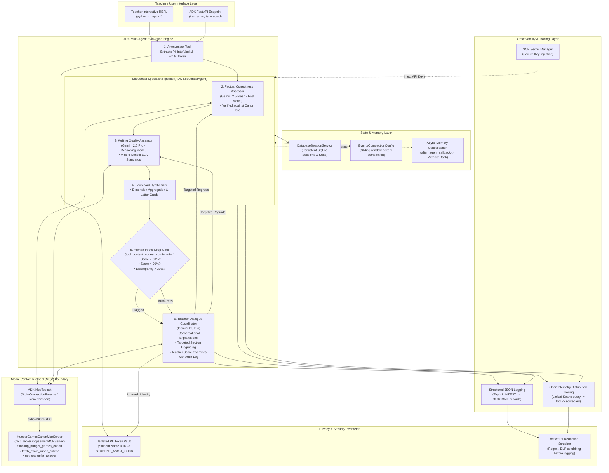

# System Architecture & Technical Design

## 1. System Architecture Overview

The **Middle School Hunger Games Assessment Agent** is engineered as a privacy-preserving, multi-agent evaluation pipeline using the Google Agent Development Kit (ADK) and Google Cloud Vertex AI Agent Runtime.

### High-Level Architecture Flowchart



---

## 2. Sequence Diagram: Lifecycle of an Exam Assessment

```mermaid
sequenceDiagram
    autonumber
    actor Teacher as Teacher / Educator
    participant CLI as Interface / App Runner
    participant Vault as PII Vault & Scrubber
    participant Corr as Correctness Agent (Flash)
    participant Qual as Quality Agent (Pro)
    participant Synth as Scorecard Synthesizer
    participant HITL as HITL Review Gate
    participant Coord as Coordinator Agent (Pro)
    participant Session as Session & Trace Store

    Teacher->>CLI: Submit exam markdown (Name, ID, Answers)
    CLI->>Vault: Extract Name & ID; Assign STUDENT_ANON_E7B1
    Vault-->>Session: Store encrypted token mapping
    
    CLI->>Corr: Run Factual Evaluation (Anonymized Answers + Key)
    Note over Corr: Gemini 2.5 Flash verifies facts<br/>against Hunger Games lore
    Corr-->>Session: Record Intent & Correctness Scores
    
    Corr->>Qual: Forward state to Writing Quality Assessor
    Note over Qual: Gemini 2.5 Pro analyzes<br/>7th-8th grade literacy standards
    Qual-->>Session: Record Intent & Quality Scores
    
    Qual->>Synth: Synthesize Scorecard
    Synth->>Synth: Compute composite score & letter grade
    
    Synth->>HITL: Check review thresholds (<60%, >90%, discrepancy >30%)
    alt Score < 60% or > 90% or Discrepancy > 30%
        HITL-->>Coord: State FLAGGED_FOR_TEACHER_REVIEW
        Coord-->>Teacher: Present Scorecard with HITL Review Alert
    else Score Normal
        HITL-->>Coord: State AUTO_APPROVED
        Coord-->>Teacher: Present Finalized Scorecard
    end

    opt Teacher Feedback & Re-dispatch Loop
        Teacher->>Coord: "Give partial credit for tracker jackers on Q2"
        Coord->>Corr: Re-dispatch Q2 Correctness with Teacher Rationale
        Corr-->>Coord: Updated Q2 Score
        Coord->>Session: Append Audit Record (Prior vs. Revised Score)
        Coord-->>Teacher: Return Updated Scorecard with Audit Diff
    end

    opt Teacher Direct Override
        Teacher->>Coord: "Override Essay 1 writing score to 18/20 due to IEP"
        Coord->>Coord: Apply manual override tool
        Coord->>Session: Append Audit Record (Direct Override with justification)
        Coord-->>Teacher: Return Updated Scorecard with Override Badge
    end

    opt Identity Unmasking
        Teacher->>Coord: Finalize and reveal student identity
        Coord->>Vault: Query real identity for STUDENT_ANON_E7B1
        Vault-->>Coord: Return "Katniss Fan (ID: 10482)"
        Coord-->>Teacher: Reveal official final grade for Katniss Fan
    end
```

---

## 3. Project Scaffolding & Directory Structure

```
ai-in-5-days-svr/
├── .agents-cli-spec.md               # Formal agents-cli system specification
├── .env.example                      # Template for secure environment configuration
├── .gitignore                        # Git ignore rules (secrets, venvs, cache)
├── Dockerfile                        # Production container image for Agent Runtime
├── README.md                         # Main repository landing page & rubric evidence
├── pyproject.toml                    # Poetry/uv packaging & dependencies
├── agents-cli-manifest.yaml          # agents-cli deployment metadata
├── app/
│   ├── __init__.py
│   ├── agent.py                      # Root ADK Sequential & Coordinator orchestration
│   ├── cli.py                        # Interactive CLI REPL for teacher grading
│   ├── fast_api_app.py               # Production ADK FastAPI web service
│   ├── config.py                     # Environment variables, thresholds, models
│   ├── constitution.py               # Robust Pedagogical Constitution (System Instructions)
│   ├── models.py                     # Strict Pydantic schemas (Submissions, Scorecard, Audit)
│   ├── agents/
│   │   ├── __init__.py
│   │   ├── correctness_agent.py      # Gemini 2.5 Flash factual assessor
│   │   ├── quality_agent.py          # Gemini 2.5 Pro writing quality assessor
│   │   ├── coordinator_agent.py      # Teacher dialogue coordinator & regrading
│   │   └── scorecard_agent.py        # Scorecard synthesis & HITL threshold checker
│   ├── tools/
│   │   ├── __init__.py
│   │   ├── anonymizer_tool.py        # PII extraction & tokenized vault tool
│   │   ├── evaluation_tools.py       # Correctness & quality evaluation tools
│   │   ├── hitl_tools.py             # Human-in-the-loop review trigger tools
│   │   └── regrade_tools.py          # Targeted agent re-dispatch & override audit tools
│   ├── memory/
│   │   ├── __init__.py
│   │   ├── session_service.py        # Persistent session store (Agent Runtime / SQLite)
│   │   ├── compaction.py             # ADK token compaction & sliding window config
│   │   └── async_memory.py           # Background async memory consolidation worker
│   └── observability/
│       ├── __init__.py
│       ├── logger.py                 # Structured JSON logging (Intent vs. Outcome)
│       ├── tracing.py                # OpenTelemetry distributed tracing setup
│       └── pii_scrubber.py           # Regex & DLP-based sensitive data scrubber
├── data/
│   ├── exam_rubric.md                # Official Middle School Hunger Games Exam Rubric
│   ├── answer_key.md                 # Canonical Hunger Games Answer Key
│   └── samples/
│       ├── student_01_passing.md     # Solid student submission (~82%)
│       ├── student_02_failing.md     # Sub-60% submission (triggers HITL low)
│       ├── student_03_honors.md      # >90% submission (triggers HITL high)
│       └── student_04_discrepant.md  # High correctness, poor writing (triggers HITL gap)
├── tests/
│   ├── __init__.py
│   ├── conftest.py                   # Pytest fixtures and mock configurations
│   ├── golden_dataset.json           # Ground-truth evaluation dataset
│   ├── test_tools.py                 # Strict schema & error handling validation
│   ├── test_agents.py                # Sequential agent & model routing tests
│   ├── test_hitl_and_audit.py        # Threshold pauses & audit trail tests
│   ├── test_observability.py         # JSON logs, Intent/Outcome, PII scrubbing tests
│   └── test_eval_harness.py          # Automated regression evaluation harness
└── deployment/
    ├── terraform/
    │   ├── main.tf                   # Terraform for Agent Runtime / Cloud Run
    │   ├── variables.tf              # Configurable project, region, service account
    │   └── outputs.tf                # Service URLs and resource IDs
    └── workflows/
        └── ci-cd.yml                 # GitHub Actions pipeline (Lint, Eval, Build, Deploy)
```

---

## 4. Key Architectural Patterns & Rubric Implementation

### 1. Tool & Interface Design (20 pts)
- **Comprehensive Docstrings**: Every tool function has extensive Sphinx-style docstrings with typed parameter definitions, operational constraints, return descriptions, and usage examples.
- **Descriptive Naming**: Granular names such as `mask_student_identifiers`, `evaluate_factual_correctness`, `evaluate_response_writing_quality`, `generate_student_scorecard`, `trigger_human_in_the_loop_review`, `regrade_assessment_section`, `override_section_score_with_audit`.
- **Explicit JSON Schemas**: Strict Pydantic v2 schemas (`StudentSubmission`, `QuestionAnswer`, `CorrectnessResult`, `QualityResult`, `Scorecard`, `AuditEntry`) validating all inputs and constraining LLM outputs.
- **Guided Error Handling**: Tools catch errors and return structured `ToolRecoveryResponse` objects containing error descriptions, error codes, and specific remediation instructions for the calling LLM.

### 2. Context & Memory (20 pts)
- **Robust System Constitution**: A comprehensive pedagogical constitution defining persona, domain boundaries (Suzanne Collins' *The Hunger Games* Book 1 only), 7th–8th grade developmental writing expectations, and fairness policies.
- **History Compaction**: Integration of ADK `EventsCompactionConfig` with token-based thresholding (32,000 tokens) and sliding window event retention (`event_retention_size=5`) to prevent context bloat during extended teacher dialogue.
- **Persistent Session State**: Automatic integration with Google Cloud Agent Runtime's `VertexAiSessionService` in production, with local SQLite fallback for testing and development.
- **Async Memory Operations**: Background consolidation via `after_agent_callback` and `asyncio.create_task` that compiles teacher preferences and class performance patterns into Memory Bank without blocking the conversational response.

### 3. Orchestration & Logic (20 pts)
- **Multi-Agent Patterns**: A deterministic `SequentialAgent` pipeline (Anonymizer -> Correctness Assessor -> Writing Quality Assessor -> Scorecard Synthesizer) coupled with an interactive Teacher Dialogue Coordinator Agent.
- **Strategic Model Routing**:
  - `gemini-2.5-flash`: Fast, high-throughput factual accuracy verification and answer key matching.
  - `gemini-2.5-pro`: Deep qualitative writing evaluation, nuanced essay reasoning, and conversational coordinator reasoning.
- **Guardrails & Policy Plugins**: Input PII anonymization guardrail, canonical grounding guardrail (preventing film-canon contamination), and self-evaluation confidence scoring.
- **Human-in-the-Loop Hooks**: Explicit execution stops triggered when overall score < 60%, > 90%, or when correctness vs. quality gap > 30%, requiring teacher authorization before final grade persistence.

### 4. Observability & Tracing (20 pts)
- **Structured JSON Logging**: Standardized JSON log output capturing timestamp, run ID, student pseudonym token, agent name, log level, and contextual metadata.
- **Intent vs. Outcome Tracking**: Explicit logging of `INTENT: <planned action>` prior to execution and `OUTCOME: <actual result/delta>` following execution for full agent explainability.
- **Distributed Tracing**: OpenTelemetry instrumentation establishing parent-child span relationships across incoming requests, agent invocations, tool executions, and LLM calls.
- **PII Redaction**: Active regex and pattern scrubbing in log sinks and OpenTelemetry attributes ensuring zero raw student names or IDs leak to storage or telemetry backends.

### 5. Infrastructure & CI/CD (15 pts)
- **Automated Evaluation Suite**: Automated test harness running against `golden_dataset.json` with assertions on factual accuracy tolerance, writing quality consistency, and HITL gate activation.
- **Infrastructure as Code**: Production Terraform declarations in `deployment/terraform/` defining Google Cloud Vertex AI Agent Runtime, IAM service accounts, and telemetry sinks.
- **Secure Secret Management**: Complete separation of secrets via environment variables (`.env.example`) and Google Secret Manager, with zero hardcoded API keys.
